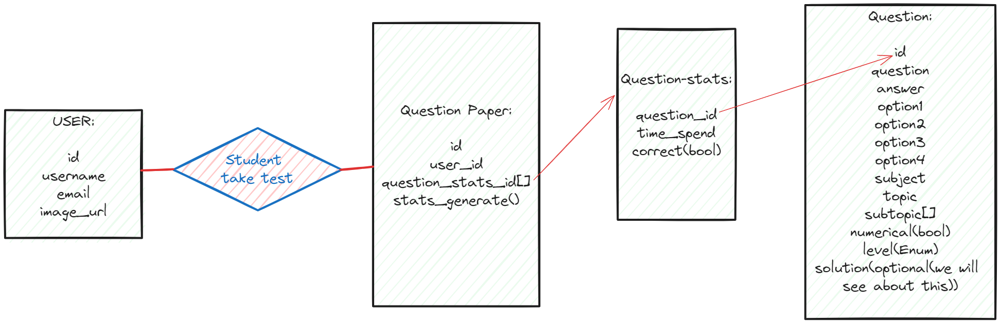

### Purpose:

The purpose of this document is to outline the specifications and requirements for the development of a web application designed to assist JEE and NEET students in generating question papers, conducting tests, and providing detailed statistics for performance evaluation.

### Project Description:

The project involves the development of a comprehensive web application that empowers students to generate customized question papers based on topics and difficulty levels relevant to JEE and NEET exams. The application will allow students to take tests, monitor their performance in real-time, and generate detailed statistics for analysis.

### System Features:

1. **User Authentication:**
   - Secure login and registration for students.
2. **Question Bank:**
   - A database of questions categorized by topics and difficulty levels.
3. **Paper Generation Module:**
   - Algorithm for creating customized question papers.
4. **Test Environment:**
   - A controlled environment for students to take tests.
5. **Real-time Monitoring:**
   - System tracking and recording time spent on each question.
6. **Performance Analysis Dashboard:**
   - Graphical representation of performance metrics.
7. **Revision Recommendations:**
   - AI-driven suggestions for topics that need revision.

### Rough Class Diagram

`Here is the rough class diagram write your suggestion in the under it.`

